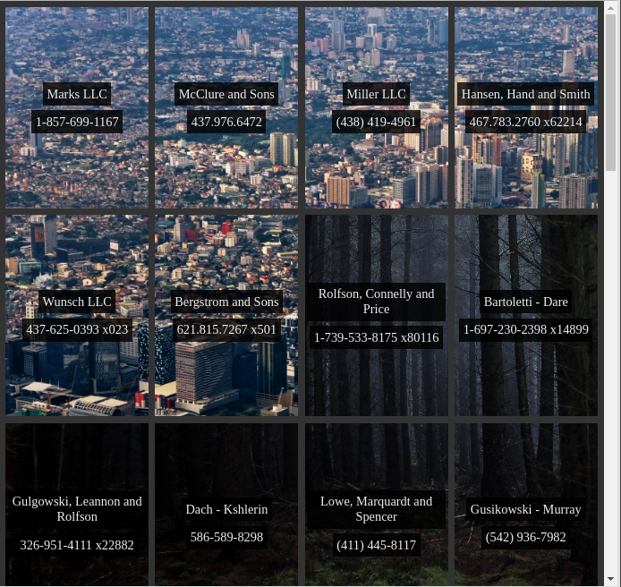

# Grid und Flexbox, in Harmonie leben!

**Regeln**

- Bearbeite nicht den HTML-Code --> nur CSS-Änderungen
- Bearbeite nicht die ersten 20 Zeilen des CSS

**Anweisungen**

1. Mache das `.container` Element zu einem Grid-Element
2. Mache das Grid zu vier Spalten, die gleichmäßig verteilt sind.
3. Füge einen Abstand von 0.5em zwischen den Grid-Elementen hinzu
4. Erstelle eine Flexbox aus allen Grid-Elementen mit einem vertikalen Layout
5. Zentriere alle Inhalte der Flexbox vertikal und horizontal
6. Färbe die Textfarbe der Grid-Elemente auf `#eee` und gib ihnen einen halbtransparenten Hintergrund
7. Füge einen Box-Shadow Hover-Effekt für die Grid-Elemente hinzu, damit es so aussieht, als würde etwas passieren, wenn du darauf klickst.
8. Füge weitere Stilelemente hinzu, bis deine Seite dem Screenshot unten entspricht

## Notizen

- BG1 ist von https://unsplash.com/photos/HM7vrtxeFDs
- BG2 ist von https://unsplash.com/photos/1L71sPT5XKc